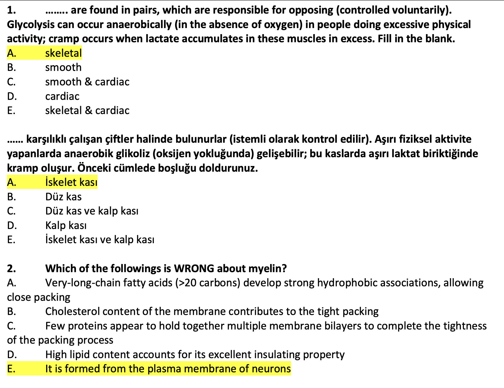
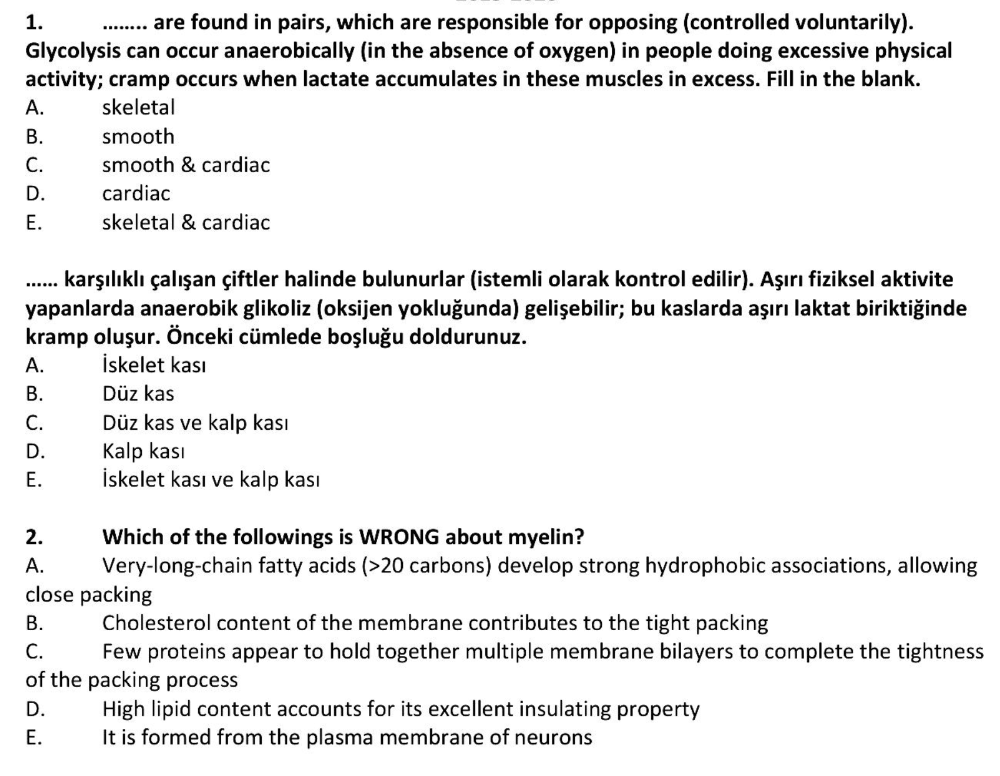

# 📝 Basit PDF Düzenleyici

Bu proje, **Python** ve **Tkinter** kullanılarak geliştirilmiş basit bir masaüstü uygulamasıdır.  
Kullanıcıların bir PDF dosyası seçmesine, seçilen dosyanın tüm sayfalarını siyah beyaza çevirmesine ve otomatik olarak parlaklık ve kontrastını artırmasına olanak tanır.

---

## 📸 Ekran Görüntüleri

### Giriş (Dosya Seçim Ekranı)


### Çıktı (İşlem Sonrası)


---

## ✨ Özellikler

- 🖱 **Kullanıcı dostu ve basit arayüz**  
- 📂 Yerel bilgisayardan **PDF dosyası seçme**  
- 🖤 PDF sayfalarını otomatik olarak **siyah beyaza (grayscale) dönüştürme**  
- 🌟 Görüntü kalitesini iyileştirmek için **parlaklık ve kontrastı otomatik artırma**  
- 💾 **İşlenmiş dosyayı** yeni bir PDF olarak kaydetme  

---

## 🚀 Kurulum ve Çalıştırma

### Gereksinimler
- Python 3.8 veya üstü  

### Adımlar

#### 1️⃣ Projeyi Klonlayın
```bash
git clone https://github.com/KULLANICI-ADINIZ/REPO-ADINIZ.git
cd REPO-ADINIZ
```

#### 2️⃣ Gerekli Kütüphaneleri Yükleyin
```bash
pip install -r requirements.txt
```

#### 3️⃣ Uygulamayı Başlatın
```bash
python pdf_editor.py
```

---

## ⚙️ Otomatik EXE Oluşturma (GitHub Actions)

Bu proje, **main** branch'ine her kod gönderildiğinde (push) otomatik olarak bir **Windows .exe** dosyası oluşturmak için GitHub Actions kullanır.  

### .exe Dosyasını İndirme
1. Bu repository'nin **Actions** sekmesine gidin.  
2. Sol menüden **"Windows icin EXE Olusturucu"** workflow'unu seçin.  
3. Başarıyla tamamlanan son çalışmaya tıklayın.  
4. Sayfanın altındaki **Artifacts** bölümünden **PDFDuzenleyici-Windows** adlı dosyayı indirin.  

---

## 📜 Lisans
Bu proje açık kaynaklıdır. Lisans bilgileri için `LICENSE` dosyasına bakın.
