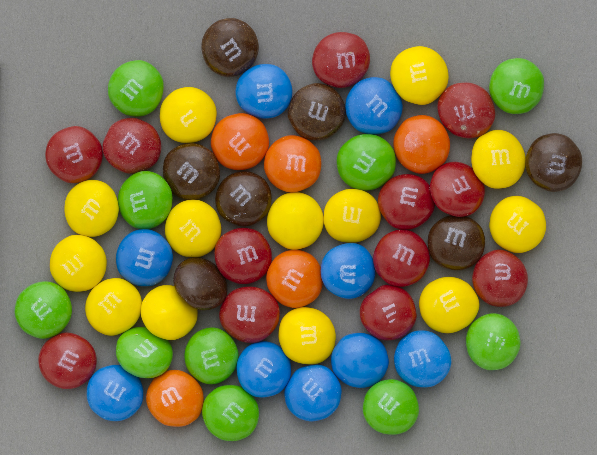
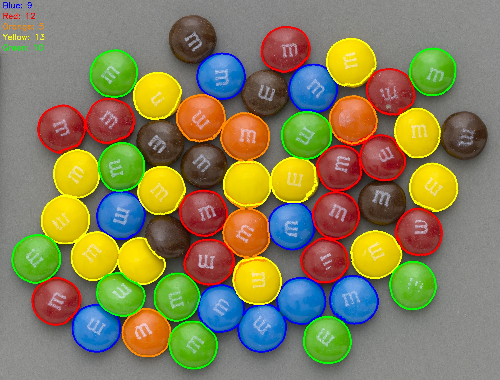

# M&M Renk Sayacı 🍬

OpenCV kullanarak M&M şekerlerini renklerine göre otomatik olarak sayan bilgisayarlı görü projesi.

## 🎯 Proje Amacı

Bu proje, bir görsel içerisindeki farklı renklerdeki M&M şekerlerini tespit edip sayar. HSV renk uzayı maskeleme tekniği ve akıllı alan tabanlı sayma algoritması kullanır.

## 📸 Input ve Output Görselleri

### Input Görseli
- `mm.jpg` - Sayılacak M&M'lerin bulunduğu ana görsel
- `template.jpg` - Tek M&M referans görseli (alan hesaplaması için)

### Output Görseli
- `result.jpg` - Tespit edilen nesnelerin işaretlendiği ve sayıların gösterildiği görsel

 ➡️ 

## 🔧 Kullanılan Teknolojiler ve Yöntemler

### 1. HSV Renk Uzayı Dönüşümü
```python
mm_hsv = cv2.cvtColor(mm, cv2.COLOR_BGR2HSV)
```
BGR yerine HSV kullanılmasının avantajları:
- Işık değişimlerine karşı daha dayanıklı
- Renk aralıklarını tanımlamak daha kolay
- İnsan görüş sistemine daha yakın

### 2. Renk Maskeleme Tekniği
Her renk için HSV aralıkları tanımlandı:

| Renk | Hue Aralığı | Saturation | Value |
|------|-------------|------------|-------|
| **Mavi** | 100-130 | 120-255 | 50-255 |
| **Kırmızı** | 0-10, 160-179 | 100-255 | 100-255 |
| **Turuncu** | 10-25 | 100-255 | 100-255 |
| **Sarı** | 25-35 | 100-255 | 100-255 |
| **Yeşil** | 35-85 | 80-255 | 80-255 |

> 🔴 **Not:** Kırmızı renk HSV'de 0° ve 360° uçlarında bulunduğu için iki ayrı aralık kullanıldı.

### 3. Contour Tespiti ve Filtreleme
```python
contours, _ = cv2.findContours(mask, cv2.RETR_EXTERNAL, cv2.CHAIN_APPROX_SIMPLE)
```
- `RETR_EXTERNAL`: Sadece dış konturları al
- İlk filtreleme: Alan > 10000 piksel

### 4. 🚀 Yenilikçi Alan Tabanlı Sayma Algoritması

#### Problem
Bazı M&M'ler birbirine değdiğinde tek contour olarak algılanıyordu. Morfolojik operasyonlar (erosion, dilation) istenen sonucu vermedi.

#### Çözüm
Template tabanlı akıllı sayma sistemi geliştirildi:

1. **Template Analizi:**
   ```python
   # Template görselinden tek M&M'in alanını hesapla
   sum_template_area = tek_mm_alani
   ```

2. **Alan Oranı ile Sayma:**
   ```python
   if area > sum_template_area*0.8 and area < sum_template_area*1.5:
       count += 1  # Tek M&M
   elif area > sum_template_area*1.5 and area < sum_template_area*2.5:
       count += 2  # İki M&M birleşik
   # ... 5 M&M'e kadar
   ```

#### Algoritma Mantığı
- Tek M&M alanı = `template_area`
- İki birleşik M&M ≈ `2 × template_area`
- N birleşik M&M ≈ `N × template_area`

Bu yöntem %20 tolerans payı ile çalışır ve 5 M&M'e kadar grupları doğru sayabilir.

## 📋 Gereksinimler

```bash
pip install opencv-python numpy
```

## 🚀 Kullanım

1. **Dosya Yapısı:**
   ```
   project/
   ├── mm_counter.py
   ├── mm.jpg          # Ana görsel
   ├── template.jpg     # Template görsel
   └── README.md
   ```

2. **Çalıştırma:**
   ```bash
   python mm_counter.py
   ```

3. **Çıktılar:**
   - Konsola renk sayıları yazdırılır
   - `result.jpg` dosyası oluşturulur
   - Sonuç görseli ekranda gösterilir

## 📊 Sonuçlar

Program her renk için:
- Console çıktısı: `Blue objects: 3`
- Görsel üzerinde contour çizimi
- Üst köşede sayı bilgileri

## 🔍 Teknik Detaylar

### HSV Değer Seçimi Stratejisi
- **Hue (Renk Tonu):** Her rengin karakteristik aralığı
- **Saturation (Doygunluk):** 80-100+ (canlı renkler için)
- **Value (Parlaklık):** 50-80+ (gölgelenmeye tolerans)

### Contour İşleme
```python
cv2.drawContours(mm, [cnt], -1, (255,0,0), 5)  # 5px kalınlığında çerçeve
```

### Görsel Açıklamalar
```python
cv2.putText(mm, f"Blue: {blue_count}", (10,30), 
            cv2.FONT_HERSHEY_SIMPLEX, 1, (255,0,0), 2)
```

## 🎯 Güçlü Yönler

✅ **HSV Maskeleme:** Işık değişimlerine dayanıklı  
✅ **Alan Filtreleme:** Gürültü eliminasyonu  
✅ **Akıllı Sayma:** Birleşik nesneleri doğru sayma  
✅ **Çoklu Renk:** 5 farklı rengi eş zamanlı işleme  
✅ **Görsel Feedback:** Sonuçları görsel olarak doğrulama  

## ⚠️ Sınırlamalar

- 5'ten fazla birleşik nesne sayılamaz
- Çok farklı boyutlardaki nesneler için uygun değil
- Aşırı gölgelenme problemli olabilir
- Template ile ana görsel aynı çözünürlükte olmalı

## 🚀 Gelecek Geliştirmeler

### Kısa Vadeli İyileştirmeler
1. **Watershed Algoritması:** Birleşik nesneleri ayırma
2. **Adaptif Eşikleme:** Farklı ışık koşulları
3. **Contour Approximation:** Daha hassas şekil tespiti
4. **Multi-scale Template:** Farklı boyutlara adaptasyon

### Uzun Vadeli Hedefler
1. **Derin Öğrenme Entegrasyonu:**
   - YOLO/SSD ile nesne tespiti
   - CNN ile renk sınıflandırma
   - Semantic segmentation

2. **İleri Teknikler:**
   - Transfer learning
   - Data augmentation
   - Real-time processing

3. **Pratik Uygulamalar:**
   - Mobil uygulama geliştirme
   - Web tabanlı interface
   - Batch processing

## 💡 Öneriler ve Katkılar

Bu proje temel bilgisayarlı görü teknikleriyle yaratıcı bir çözüm sunuyor. Geliştirme önerilerinizi paylaşabilirsiniz:

- **Issue açın:** Problem raporları için
- **Pull request:** Kod iyileştirmeleri için
- **Diskasyon:** Yeni fikirler için

## 📝 Lisans

MIT License - Açık kaynak kullanım için uygun

## 🤝 İletişim

Sorularınız ve önerileriniz için benimle iletişime geçebilirsiniz.

---
*Bu proje, temel bilgisayarlı görü tekniklerinin yaratıcı kullanımına örnek teşkil eder.*